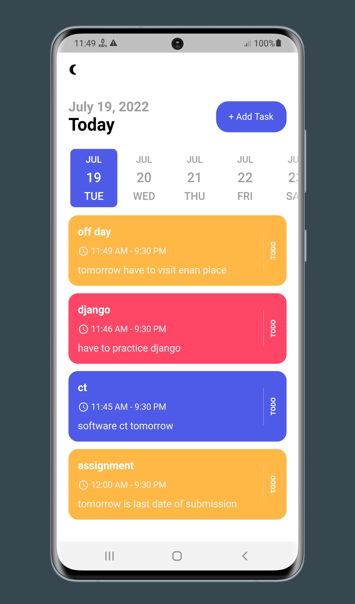

# Introduction
> "Todo App"

A simple todo app where user can add their task. User can mark an added task as completed . They can delete only completed task or all added task as they wish.

## :bulb: Key Features (or What will you learn, if you are here to learn)

- [x] Local push notification
- [x] Scheduled notification
- [x] Dynamic theme change
- [x] Save theme data to local storage
- [x] Sqlite and Sqflite CRUD
- [x] GetX Listview
- [x] ShowTimePicker and ShowDatePicker
- [x] Flutter staggered animation

## 🚀 &nbsp;Installation

To clone and run this application, you'll need [Git](https://git-scm.com) and [Flutter](https://flutter.dev/docs/get-started/install) installed on your computer. From your command line:

```bash
# Clone this repository
$ git clone https://github.com/mostafijur566/todo_app_flutter.git

# Go into the repository
$ cd todo_app_flutter

# Install dependencies
$ flutter pub get

# Run the app
$ flutter run

# You can also run this app on Web (Not Optimized and Flutter Beta or Above Channel Required)
$ flutter run -d chrome
```

### Packages

Below are the information about packages used in this project.

| Package                                                                                  |
| ---------------------------------------------------------------------------------------- | 
| [get_storage](https://pub.dev/packages/get_storage)                                      |
| [get](https://pub.dev/packages/get)                                                      |
| [flutter_local_notifications](https://pub.dev/packages/flutter_local_notifications)      |
| [flutter_native_timezone](https://pub.dev/packages/flutter_native_timezone)              |
| [intl](https://pub.dev/packages/intl)                                                    |
| [google_fonts](https://pub.dev/packages/google_fonts)                                    |
| [date_picker_timeline](https://pub.dev/packages/date_picker_timeline)                    |
| [sqflite](https://pub.dev/packages/sqflite)                                              |
| [flutter_staggered_animations](https://pub.dev/packages/flutter_staggered_animations)    |


### Directory Structure

The project directory structure is as follows:

```
├── android
├── assets
├── build
├── ios
├── lib
    ├── controller
    ├── db
    ├── models
    ├── services
    ├── ui
    ├── utils
    ├── widgets
    ├── main.dart
├── pubspec.lock
├── pubspec.yaml

```

## :heart: Contributor

Made by [Mostafijur Rahman](https://github.com/mostafijur566)

## :camera_flash: Screenshots

   
      
   
   
